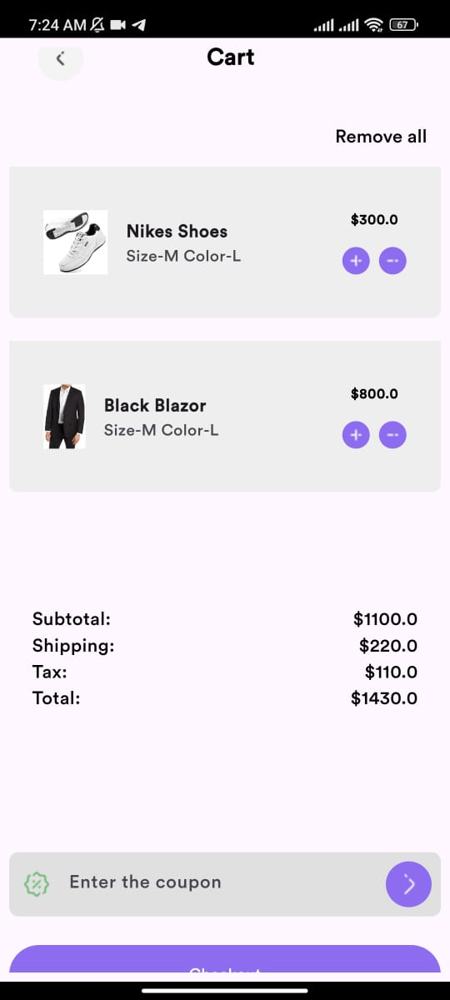

# Introduction

## Features
- Implemented MVVM Architecture to separate the layers, and make the development process even better  
- Used Hive as my local database for caching, improving the user experience, and to prevent loading data each time the app is opened  
- Used Supabase as a quick solution for the database and authentication  
- Integrated with Paymob as my payment gateway to support the payments in Egypt  
- Most important screens are implemented:  
- Login Page  
- Sign up Page  
- Home Page  
- Notifications Page  
- Order Page  
- Order Details Page  
- Product Details Page  
- Profile Page  
- Search Page  
- Categories Page  
- Cart Page  

- Checkout Page  

## Backend
Used Supabase to store the users data, along with the products, orders, and the notifications of each users,
and enabled the policies of the CRUD on Supabase database

## Downloading the app
Inside the release folder you will find the APKs, download the V2 it's the latest one.
